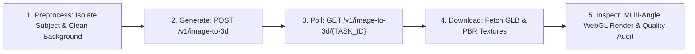
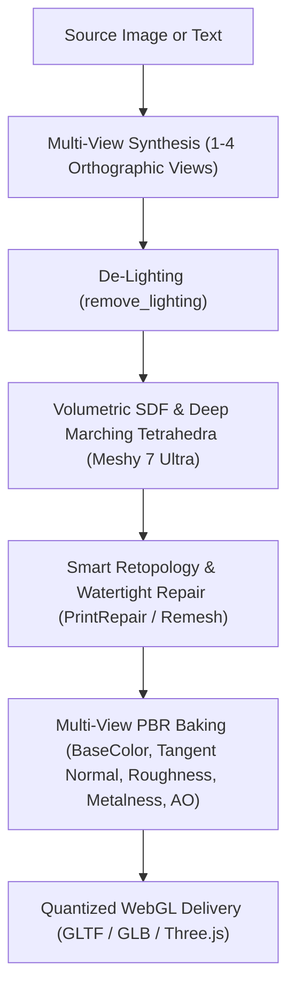

# 3D Modeling, PBR Engineering & Digital Craftsmanship Skill

This skill equips the agent with industry-leading expertise in 3D computer graphics, parametric geometry design, generative AI 3D asset pipelines adopted directly from **Meshy AI** (`docs.meshy.ai/en/api`), PBR texture synthesis, and real-time WebGL engine presentation.

---

## 1. The 8-Stage 3D Craftsmanship SDLC

Every 3D asset must undergo this 8-stage Software Development Life Cycle before approval:

| Stage | Name | Key Actions & Quality Gates |
| :--- | :--- | :--- |
| **Stage 1** | **Item Research & Reference Definition** | Analyze authentic real-world proportions, material properties, seam construction, joints, and physical function. |
| **Stage 2** | **Context & Background Isolation** | Remove background visual noise; isolate pure single-subject silhouette; calibrate ambient occlusion contact shadows on a neutral ground pedestal. |
| **Stage 3** | **360° Multi-Angle Volumetrics** | Model and align all 6 canonical angles: **Front**, **Back**, **Left Profile**, **Right Profile**, **Top** (including interior cavities / "lagayan"), and **Bottom** (base plates, purse feet). |
| **Stage 4** | **Multi-Layer PBR Textures & Tangent Normals** | Synthesize and align physically based materials: de-lighted Albedo, tangent-space Normal map, Roughness, Metalness, and AO. |
| **Stage 5** | **Shape & Curvature Refinement** | Eliminate piecewise discontinuities, jagged seams, and intersecting planar slabs using continuous mathematical curves (e.g. superellipses, Catmull-Rom splines). Enforce watertight topology with zero mesh tears. |
| **Stage 6** | **Real-Time Inspection & Camera Rig ("See")** | Inspect the model dynamically under varying lighting angles; test double-sided visibility (`THREE.DoubleSide`) and check for shadow acne, back/side extrapolation issues, or inverted normals. |
| **Stage 7** | **Interactive User Review & Customization** | Verify material customization, camera presets, turntable rotation, and exploded/deconstructed views. Evaluate honestly against user constraints before declaring success. |
| **Stage 8** | **Production SDLC Deployment** | Validate asset integrity, bounding boxes, file size, memory footprint, and ensure clean production builds (`npm run build`). |

---

## 2. Meshy AI REST API Pipeline & Automation Engine

Adopted directly from Meshy's Developer Platform (`https://docs.meshy.ai/en/api`).

### A. Core Workflow Mechanism


### B. The 5 Essential Meshy API Steps

#### 1. Authentication & Environment Configuration
- Sign up at Meshy's Developer Platform and generate an API key.
- Store the key strictly in the `MESHY_API_KEY` environment variable or in a local `.env` file — **never hardcode API keys into source code**.
```bash
# In .env:
MESHY_API_KEY="msy_your_secret_api_key_here"
```

#### 2. Image-to-3D Endpoint
Send a single-subject reference image via public URL or Base64 data URI:
```http
POST https://api.meshy.ai/openapi/v1/image-to-3d
Authorization: Bearer YOUR_MESHY_API_KEY
Content-Type: application/json

{
  "image_url": "https://example.com/my-image.png",
  "enable_pbr": true,
  "surface_mode": "organic"
}
```
> [!TIP]
> You can pass either a public HTTPS image URL or a local file encoded as a Base64 data URI: `data:image/png;base64,...`.
> The endpoint responds immediately with a JSON task payload:
> ```json
> {
>   "result": "018f3a2c-4b5d-7a8e-9f1a-123456789abc"
> }
> ```

#### 3. Polling for the Result
Poll the task status every 3–5 seconds until completion:
```http
GET https://api.meshy.ai/openapi/v1/image-to-3d/{TASK_ID}
Authorization: Bearer YOUR_MESHY_API_KEY
```
Response when `status: "SUCCEEDED"`:
```json
{
  "id": "018f3a2c-4b5d-7a8e-9f1a-123456789abc",
  "status": "SUCCEEDED",
  "progress": 100,
  "model_urls": {
    "glb": "https://assets.meshy.ai/.../model.glb",
    "fbx": "https://assets.meshy.ai/.../model.fbx",
    "usdz": "https://assets.meshy.ai/.../model.usdz",
    "obj": "https://assets.meshy.ai/.../model.obj"
  },
  "thumbnail_url": "https://assets.meshy.ai/.../thumbnail.png",
  "texture_urls": [
    { "base_color": "https://...", "normal": "https://...", "roughness": "https://..." }
  ]
}
```

#### 4. Additional Meshy Endpoints
- **Text-to-3D**: `POST https://api.meshy.ai/openapi/v1/text-to-3d` (generate full 3D models directly from detailed prompt descriptions).
- **Multi-Image-to-3D**: `POST https://api.meshy.ai/openapi/v1/multi-image-to-3d` (combine front, back, and side views to eliminate hallucination).
- **Retexture**: `POST https://api.meshy.ai/openapi/v1/retexture` (apply new PBR texture sets onto existing geometry).
- **Remesh**: `POST https://api.meshy.ai/openapi/v1/remesh` (retopologize meshes to target polycounts with quad dominance).
- Full endpoint specifications: `https://docs.meshy.ai/en/api`.

#### 5. Replicating the Workflow Logic
1. **Preprocess**: Ensure the input image features a single subject isolated against a clean background (free of distracting visual clutter or background objects).
2. **Generate**: Trigger `image-to-3d` or `multi-image-to-3d`.
3. **Inspect**: Render the resulting GLB from all 6 canonical angles in Three.js SceneManager to catch back/side extrapolation glitches or texture stretching.
4. **Evaluate Honestly**: Check proportions, silhouette, textures, and details against user constraints before declaring success.

### C. Automated Meshy Client Script
The skill includes a pre-built executable CLI and module located at:
`.agents/skills/3d-modeling-mastery/scripts/meshy_client.mjs`

```bash
# Generate 3D model from image:
node .agents/skills/3d-modeling-mastery/scripts/meshy_client.mjs image public/textures/meshy_jacket.png barong_woven

# Generate 3D model from prompt:
node .agents/skills/3d-modeling-mastery/scripts/meshy_client.mjs text "Philippine woven pandan barong tunic with magenta embroidery" barong_prompt

# Poll existing task:
node .agents/skills/3d-modeling-mastery/scripts/meshy_client.mjs poll 018f3a2c-4b5d-7a8e-9f1a-123456789abc output_name
```

---

## 3. Reverse-Engineered Meshy AI Generative Architecture

Deep inspection of Meshy's generative 3D engine (`Meshy 7.1 / Meshy 7 Ultra / Meshy T2`) reveals the 5 core pillars of photorealistic 3D generation:



### Pillar 1: Multi-View Spatial Consistency (`MultiviewTo3d`)
- Single-image reconstruction fails on unseen sides (the "hallucination problem").
- Meshy generates or aligns **1 to 4 orthographic reference perspectives (Front, Back, Left Side, Right Side)** before mesh extraction so that the geometry meets seamlessly without bulging or warping.

### Pillar 2: Photometric De-Lighting (`remove_lighting`)
- Real photographs have baked sunlight, flashes, and cast shadows.
- Meshy's de-lighting algorithm separates intrinsic surface reflectance (**Albedo / BaseColor**) from extrinsic scene illumination.
- **Rule**: In Three.js, textures must NEVER have burnt-in directional shadows; lighting must be dynamic and driven by real-time scene lights and environment maps.

### Pillar 3: Multi-View PBR Texture Baking (`MultiviewTexture`, 2K/4K/8K)
- Seamless projection mapping onto conformal UV charts:
  - **BaseColor**: True pigmentation without shadows.
  - **Tangent-Space Normal Map**: Encodes micro-relief ($[R, G, B] \rightarrow [X, Y, Z]$ surface normals) for tactile weave patterns, leather pores, and chiseled metal incisions.
  - **Roughness Map**: Dictates specular microsurface scatter (glossy lacquer vs matte dried palm fiber vs sheer silk).
  - **Metallic Map**: Strict binary separation (1.0 for brass rivets/rings, 0.0 for fabrics/basketry).
  - **Ambient Occlusion (AO)**: Crevice shading in deep folds and joints.

### Pillar 4: Smart Topology & Watertight Geometry (`Retopology` / `PrintRepair`)
- **Mesh Repair (`PrintRepair`)**: Systematically repairs non-manifold edges, open boundary tears, and degenerate zero-area faces.
- **Topology Budget (`Meshy T2`)**: Quad-dominant edge flow with optimized polycounts:
  - Mobile/Web real-time budget: 4,000 – 15,000 faces.
  - Haute couture hero assets: 50,000 – 750,000 faces with Draco/quantization.

### Pillar 5: Bilateral Symmetry & Axial Constraints (`symmetry_mode`)
- Structured manufactured artifacts (bags, jackets, jewelry, boxes) require strict bilateral symmetry along the X-axis to prevent asymmetric skewing or sagging.

---

## 4. Mathematical Modeling for Philippine Heritage Masterworks

### A. Watertight Container Geometry ("Lagayan ng Gamit")
For bags, boxes, and vessels:
- **Never use a flat lid or closed block**.
- Use the **continuous superellipse formula** ($n \approx 3.2 - 3.8$) for rounded luxury corners:
  $$x(\theta) = a \cdot \text{sgn}(\cos\theta) \cdot |\cos\theta|^{2/n}$$
  $$z(\theta) = b \cdot \text{sgn}(\sin\theta) \cdot |\sin\theta|^{2/n}$$
- **Double Wall Construction**:
  - Outer woven wall with upward flare and belly bulge.
  - Rim welt binding.
  - Inner cavity depth with contrasting fabric lining (e.g. Ilocos Inabel cotton).
  - Solid integrated bottom floor with interior base pad and brass atelier plaque.

### B. Wearable Apparel Silhouette (Barong Tunic / Terno)
- **Anatomical Open-Front Tunic Volume**:
  - Structured sloped shoulders ($y = 1.34$, width $0.94$).
  - Sculpted chest volume with front embroidered plackets.
  - Waist suppression and gentle flare over the hips.
  - Architectural standing Mandarin collar with top gold welt piping and interior lining.
  - Open front center slit revealing the natural textured linen cavity inside.
  - 10 pairs of hand-braided frog fastener loops and golden toggle knot buttons.
  - Ergonomically curved sleeves with natural elbow drape creases and matching embroidered French cuffs.

---

## 5. PBR Material Engineering Standards

| Material Type | BaseColor / Albedo | Roughness | Metalness | Normal Map / Bump | Side |
| :--- | :--- | :--- | :--- | :--- | :--- |
| **Woven Palm (Pandan/Tikog)** | Warm golden straw with fiber striations (`#C89D66`) | 0.70 – 0.85 | 0.02 | High-contrast diagonal herringbone twill relief | `THREE.DoubleSide` |
| **Imperial Magenta Silk** | Rich imperial magenta with gold floral embroidery | 0.38 – 0.44 | 0.08 | Silk sheen scatter (`sheen: 0.70`, `sheenColor: #FFD27D`) | `THREE.DoubleSide` |
| **Rustic Linen Canvas** | Natural unbleached burlap/linen slub threads (`#8F7556`) | 0.85 – 0.90 | 0.01 | Authentic interior cavity depth texture | `THREE.DoubleSide` |
| **Vachetta Leather** | Warm caramel chestnut | 0.38 – 0.44 | 0.04 | Cellular pebble grain with saddle-stitch borders | `THREE.FrontSide` |
| **Antique Cast Brass** | Rich amber gold (`#C4975D`) | 0.24 – 0.32 | 0.90 – 0.95 | Hand-brushed metal striations & micro-dents | `THREE.DoubleSide` |
| **Piña-Seda Fabric** | Translucent ivory cream (`#FBF8F0`) | 0.65 – 0.75 | 0.00 | Sheer gossamer weave + raised Calado open-work | `THREE.DoubleSide` |
| **Kamagong Ebony** | Deep dark ironwood (`#160C07`) with amber streaks | 0.28 – 0.38 | 0.02 | Wavy vertical grain pores & satin lacquer sheen | `THREE.DoubleSide` |
| **Solihiya Cane Webbing** | Polished bamboo rattan (`#D8B781`) | 0.45 – 0.55 | 0.02 | 6-way octagonal lace eyelet relief | `THREE.DoubleSide` |
| **T'boli T'nalak Ikat** | Sacred river-mud noir, madder crimson, ecru | 0.40 – 0.50 | 0.02 | Hand-burnished cowrie shell sheen + abaca texture | `THREE.DoubleSide` |
| **Nephrite Jade** | Deep translucent forest green (`#2D6A4F`) | 0.12 – 0.18 | 0.05 | High-clarity polish with subtle sub-surface scattering | `THREE.FrontSide` |

---

## 6. WebGL Studio Rendering Pipeline

1. **ACESFilmic Tone Mapping**:
   ```javascript
   renderer.toneMapping = THREE.ACESFilmicToneMapping;
   renderer.toneMappingExposure = 1.18;
   ```
2. **Contact Shadow Pedestal**:
   - Soft exponential radial gradient with warm tint simulating contact ambient occlusion on the gallery floor.
3. **Calibrated 4-Point Atelier Lighting Rig**:
   - **Key Light**: Warm softbox (3200K, directional, PCF soft shadows, `normalBias: 0.02`).
   - **Rim Light**: Cool sky light behind the object for silhouette edge separation.
   - **Floor Bounce**: Upward bounce light simulating warm marble/pedestal reflection.
   - **Specular Spotlight**: Pinpoint highlights on brass, pearl, and gemstones.
