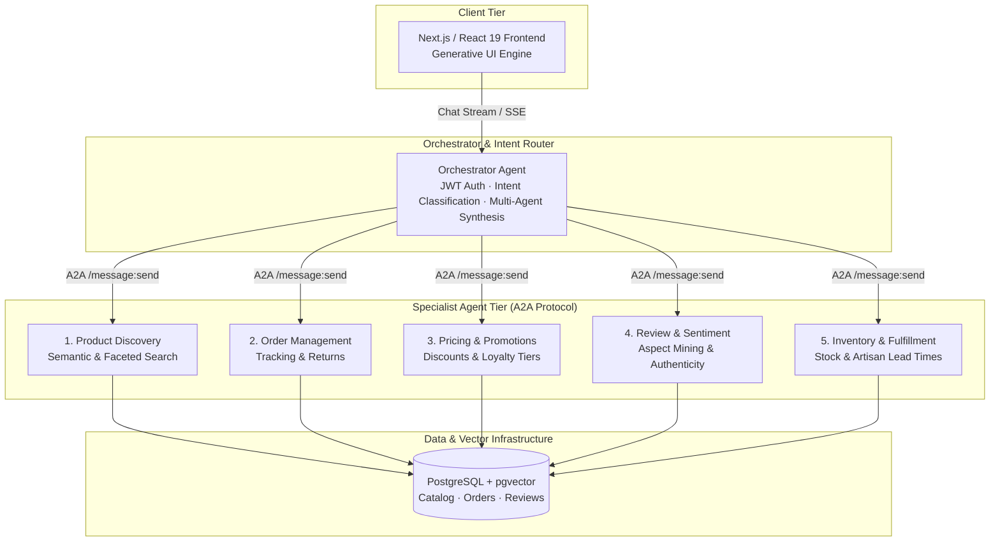
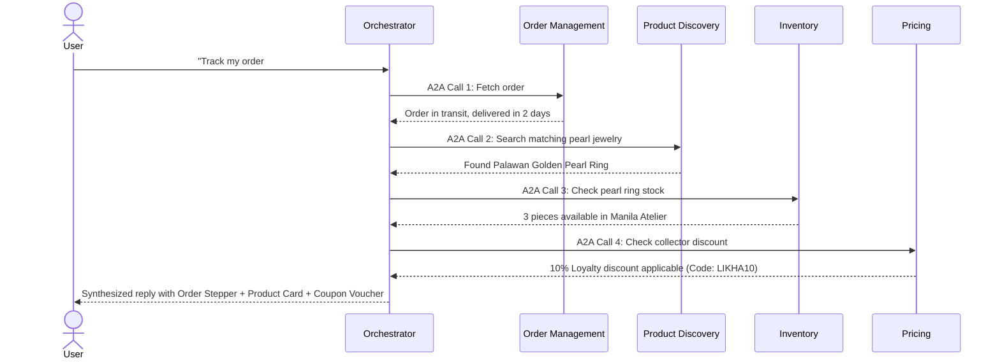

# Multi-Agent E-Commerce Architecture Skill

Adopted directly from **E-Commerce Agents** (`https://github.com/nitin27may/e-commerce-agents`), built on Microsoft Agent Framework (MAF), FastAPI, Next.js, and PostgreSQL + pgvector.

---

## 1. System Overview & The 6 Specialized Agents

The architecture splits monolithic e-commerce logic into **one Orchestrator** and **five Specialist Agents** communicating over the **A2A (Agent-to-Agent) protocol**:

---

## 2. Specialist Agent Matrix & Tool Registry

| Agent | Core Responsibility | Key Tools & Functions | Generative UI Output |
| :--- | :--- | :--- | :--- |
| **Orchestrator** | Intent classification, conversation context, specialist dispatch, and final multi-agent synthesis. | `route_intent()`, `call_specialist_agent()`, `synthesize_response()` | Agent Activity Timeline disclosure, multi-agent status badges |
| **Product Discovery** | Natural language semantic discovery, price/region filtering, recommendations, and product comparisons. | `search_products()`, `semantic_search()`, `compare_products()`, `get_recommendations()` | Interactive Product Cards with "View in 3D" and "Add to Cart" actions |
| **Order Management** | Order tracking, milestone timelines, cancellations, and return eligibility verification. | `get_user_orders()`, `get_order_tracking()`, `cancel_order()`, `initiate_return()` | Visual Order Milestone Stepper (Placed -> Crafting -> Inspected -> Dispatched -> Delivered) |
| **Pricing & Promotions** | Coupon validation, discount application, loyalty tier perks, and artisan fair-trade splits. | `validate_coupon()`, `get_active_deals()`, `calculate_loyalty_tier()`, `calculate_split()` | Interactive Coupon Cards with 1-click "Claim/Apply" button and savings breakdown |
| **Review & Sentiment** | Customer review aggregation, sentiment topic extraction, and verified buyer checks. | `get_product_reviews()`, `analyze_sentiment()`, `get_topic_breakdown()`, `detect_fake_reviews()` | Rating Distribution Chart, Aspect Sentiment Gauges, and Verified Buyer Testimonial Badges |
| **Inventory & Fulfillment** | Real-time stock levels, batch allocation, handcrafted lead times, and warehouse dispatch estimates. | `check_stock()`, `get_batch_status()`, `estimate_lead_time()`, `get_artisan_coop()` | Stock Level Badges ("Limited Batch: 2 Left"), Artisan Lead Time Callout |

---

## 3. Generative UI Philosophy (Strict Rule: Never Dump Raw JSON)

The chat interface **never dumps raw JSON or unformatted prose** when structured data is returned:

1. **Product Query** $\to$ Render an interactive grid or carousel of **Product Cards** with image, title, price, artisan region, and actionable buttons.
2. **Order Inquiry** $\to$ Render a visual **Order Stepper** with progress bar, delivery date, courier name, and current fulfillment phase.
3. **Discount Query** $\to$ Render **Coupon Voucher Badges** with copy/apply action and countdown/expiry tags.
4. **Review Query** $\to$ Render **Sentiment Aspect Bars** (e.g., Craftsmanship 98%, Material Quality 96%) and star ratings.
5. **Inventory Query** $\to$ Render a **Batch Remaining Meter** and craft timeline estimate.

---

## 4. Multi-Agent Collaboration Flows

### Scenario A: Complex Return & Repurchase

---

## 5. Implementation Standards for Pinoy Online Shop

1. **Client-Side & Serverless Agility**:
   - Provide an in-browser Multi-Agent Orchestration Engine inside `ConciergeModal.jsx` that runs instantaneously with zero cold-start delay.
   - Support seamless fallback between local rule-based intent parsing and remote LLM endpoints.
2. **Heritage Cultural Resonance**:
   - Reflect Philippine artisan cooperatives, regional origins (Lumban, Basey, Lake Sebu, Meycauayan, Palawan, Vigan), and fair-trade metrics.
3. **Interactive 3D Integration**:
   - Product recommendations link directly to the Three.js 3D viewport, allowing users to inspect items in real time.
